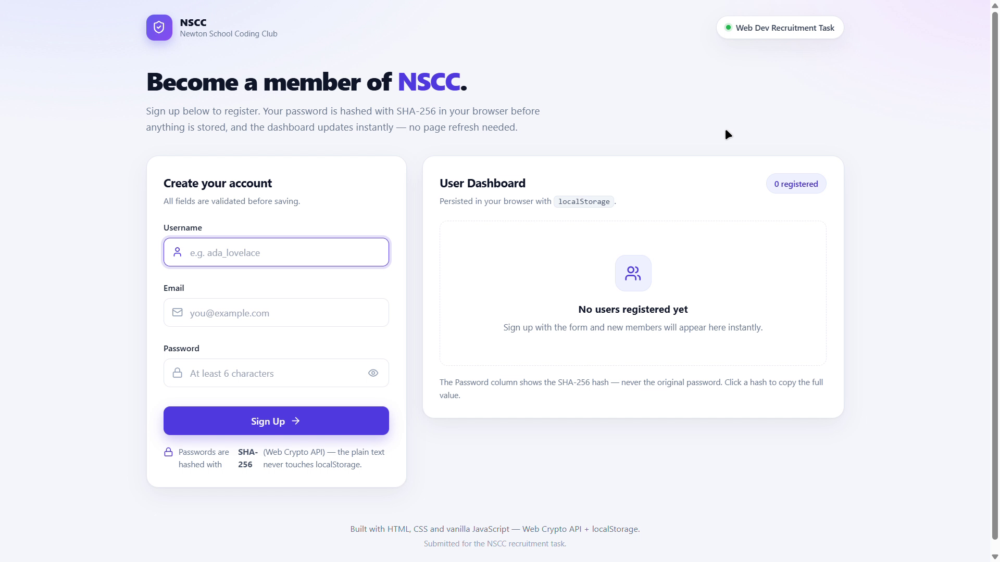

# NSCC Signup & User Dashboard

A clean, responsive **HTML + CSS + vanilla JavaScript** web application built for the **Newton School Coding Club (NSCC) recruitment task**.

The project demonstrates client-side form validation, regular expressions, asynchronous password hashing with the Web Crypto API, browser `localStorage`, dynamic DOM rendering, and individual user deletion.

**GitHub Pages:** `https://kashiffazili.github.io/nscc-signup-dashboard/`

> **Before submission:** replace `YOUR-GITHUB-USERNAME` with your actual GitHub username after enabling GitHub Pages. Keep this link updated in this task folder's README as requested in the submission instructions.

## 🖼️ Project Preview



> **Important:** This is an educational frontend assignment. Storing even hashed passwords in `localStorage` is not suitable for real authentication. Production applications should hash passwords on a trusted server using a password-specific algorithm such as Argon2, scrypt, or bcrypt.

## ✨ Features

### Required task features

- Signup form with **Username, Email, and Password** fields
- Username cannot be empty
- Email validated with a regular expression
- Password must be at least 6 characters
- Password is hashed with **SHA-256 using the Web Crypto API** before storage
- User data stored in `localStorage`
- Multiple users supported
- Dashboard table showing Username, Email, Password Hash, and Action
- Dashboard restored automatically after refresh
- **Delete** button for every user (brownie subtask)
- Delete confirmation before removing a user
- UI updates immediately after signup or deletion

### Additional polish

- Duplicate email prevention
- Show/hide password control
- Inline validation messages
- Accessible labels and focus states
- Loading state while the asynchronous hash is generated
- Success/error toast notifications
- Empty-state dashboard
- Full SHA-256 hash shown in the table and click-to-copy support
- Responsive dashboard that becomes mobile-friendly cards on smaller screens
- Keyboard support for the delete dialog (`Escape` and overlay click)
- Reduced-motion support
- Safe DOM rendering with `textContent` for user-provided values
- Defensive handling of malformed `localStorage` data

## 🛠️ Technologies Used

- **HTML5** — semantic page structure and accessible form controls
- **CSS3** — responsive layout, custom properties, animations, and media queries
- **JavaScript (ES6+)** — validation, DOM manipulation, events, storage, and UI logic
- **Web Crypto API** — SHA-256 password hashing
- **localStorage** — browser-side persistence

No React, TypeScript, Tailwind, Bootstrap, or other framework/library is required.

## 📁 Project Structure

```text
nscc-signup-dashboard/
├── assets/
│   ├── demo-dashboard.png  # Project screenshot for documentation
│   └── nscc-logo.png       # NSCC logo with transparent background
├── index.html               # Page structure and accessible UI
├── style.css                # Complete responsive styling
├── script.js                # Validation, hashing, storage, rendering, and events
├── .gitignore               # Common local/editor files to ignore
└── README.md                # Project documentation
```

The repository intentionally contains only the files needed for the task. There is **no build system or dependency installation**.

## ▶️ How to Run

### Option 1 — Open directly

1. Download or clone the repository.
2. Open the project folder.
3. Open `index.html` in a modern browser.

### Option 2 — Recommended: use a local server

From the project folder, run:

```bash
python -m http.server 8000
```

Then open:

```text
http://localhost:8000
```

A local server is recommended because browser security rules can differ for files opened directly with `file://`.

## 🔄 How the Application Works

```text
User enters details
        ↓
Form submission is intercepted
        ↓
Username / Email / Password validation
        ↓
Check for duplicate email
        ↓
SHA-256 password hashing
        ↓
Create user object with a unique ID
        ↓
Save user array to localStorage
        ↓
Re-render dashboard
```

### Signup

1. The submit event calls `handleSignup()`.
2. `event.preventDefault()` stops the browser from reloading the page.
3. The input values are read and validated.
4. The email is checked against the regex.
5. Existing users are checked for duplicate email addresses.
6. `hashPassword()` uses `crypto.subtle.digest("SHA-256", ...)`.
7. Only the resulting hash is placed in the user object.
8. The users array is serialized with `JSON.stringify()` and saved to `localStorage`.
9. `renderUsers()` immediately rebuilds the dashboard.

### Delete

1. Each Delete button contains the user's unique `id` in a `data-id` attribute.
2. Event delegation handles clicks from the table body.
3. A confirmation dialog is shown.
4. `deleteUser(id)` uses `filter()` to remove only the matching user.
5. The updated array is saved and the dashboard is rendered again.

## 🧠 JavaScript Functions

| Function | Purpose |
|---|---|
| `getUsers()` | Reads and safely parses users from `localStorage`. |
| `saveUsers(users)` | Converts the users array to JSON and stores it. |
| `validateUsername()` | Checks that the username is not empty. |
| `validateEmail()` | Checks required input and validates the email regex. |
| `validatePassword()` | Checks the 6-character minimum. |
| `showFieldError()` | Displays or clears a field's validation error. |
| `clearAllErrors()` | Clears all validation messages. |
| `hashPassword()` | Generates a SHA-256 hexadecimal hash asynchronously. |
| `renderUsers()` | Reads users and updates the dashboard. |
| `createTableRow()` | Safely creates one table row using DOM APIs. |
| `showToast()` | Displays temporary feedback to the user. |
| `createId()` | Creates a unique ID for reliable deletion. |
| `setLoading()` | Controls the signup button's loading state. |
| `handleSignup()` | Coordinates validation, hashing, saving, and rendering. |
| `togglePasswordVisibility()` | Shows or hides the password input. |
| `openConfirmModal()` | Opens the delete confirmation dialog. |
| `closeConfirmModal()` | Closes and resets the dialog. |
| `deleteUser()` | Removes exactly one user by ID. |
| `copyHash()` | Copies the complete hash to the clipboard. |
| `handleTableClick()` | Handles dynamically rendered Delete/hash clicks. |

## 📚 Concepts Demonstrated / Learned

- DOM selection and manipulation
- `addEventListener()`
- Form submission and `preventDefault()`
- Client-side validation
- Regular expressions
- `async` / `await`
- Promises
- Web Crypto API
- One-way hashing
- `TextEncoder`
- `JSON.stringify()` and `JSON.parse()`
- `localStorage`
- Arrays and `filter()` / `some()`
- Event delegation
- `data-*` attributes
- Dynamic table generation
- Accessible UI basics
- Responsive CSS
- Safe DOM insertion with `textContent`

## 🚀 Deployment — GitHub Pages

This project is a static website, so it can be deployed directly with GitHub Pages. No build command or package installation is required.

1. Create a **public** GitHub repository named `nscc-signup-dashboard`.
2. Upload the contents of this folder to the repository root. Make sure `index.html` is at the root level.
3. Open **Settings → Pages** in the GitHub repository.
4. Under **Build and deployment**, choose **Deploy from a branch**.
5. Select the `main` branch and the `/ (root)` folder, then click **Save**.
6. Wait for GitHub Pages to finish deploying.
7. Open the generated Pages URL and test the complete application.
8. Replace the placeholder in the **Live Demo** section above with the actual deployed URL.

### Deployment checklist

- [ ] Repository is public
- [ ] `index.html` is in the repository root
- [ ] `assets/nscc-logo.png` is present
- [ ] GitHub Pages is enabled
- [ ] Live link opens successfully
- [ ] Signup, hashing, localStorage, and delete functionality work on the live site
- [ ] Live deployment link is added to this README

## 🔐 Security Note

The assignment explicitly requires password hashing and storing user details in `localStorage`, so this project follows that requirement.

However, this should **not** be confused with production authentication:

- SHA-256 is a general-purpose hash and is too fast for password storage in real systems.
- Real applications should use a password-specific, deliberately slow and salted algorithm such as **Argon2, scrypt, or bcrypt** on the server.
- `localStorage` can be read by JavaScript running in the page's origin, so it should not be treated as a secure credential store.
- Client-side validation improves user experience but must never replace server-side validation.

## 🧪 Manual Testing Checklist

Before submission, verify:

- [x] Empty username is rejected
- [x] Empty email is rejected
- [x] Invalid email format is rejected
- [x] Password shorter than 6 characters is rejected
- [x] Valid user can sign up
- [x] Multiple users can be added
- [x] Plaintext password is not stored in `localStorage`
- [x] Stored SHA-256 hash is 64 hexadecimal characters
- [x] Dashboard updates without refreshing
- [x] Users remain after refresh
- [x] Duplicate email is rejected
- [x] Delete confirmation appears
- [x] Only the selected user is deleted
- [x] Empty state appears after deleting the last user
- [x] Password visibility toggle works
- [x] Hash copy action works when clipboard permission is available
- [x] Layout remains usable on mobile
- [x] Keyboard focus states are visible

## 🚀 Future Improvements

- Backend API and database
- Real authentication and sessions
- Argon2/bcrypt/scrypt password hashing on the server
- Server-side validation
- Edit-user functionality
- Search and sorting
- Pagination for larger datasets

## 📌 Submission Notes

The repository is intentionally dependency-free so an evaluator can understand and run the project immediately.

Recommended GitHub repository name:

```text
nscc-signup-dashboard
```

Recommended repository description:

```text
NSCC recruitment task — responsive signup form with validation, SHA-256 password hashing, localStorage persistence, and a user dashboard with delete functionality.
```


## Self-contained Project

This project uses only HTML, CSS, and vanilla JavaScript. It has no framework, package manager, build step, or external runtime dependency. The page can be opened directly from `index.html` in a modern browser.

The interface uses a local system font stack so the project remains usable even without an internet connection.


> Email validation uses a practical list of common valid TLDs (such as `.com`, `.org`, `.net`, `.in`, and `.co.in`) so common typos such as `.con` are rejected.
